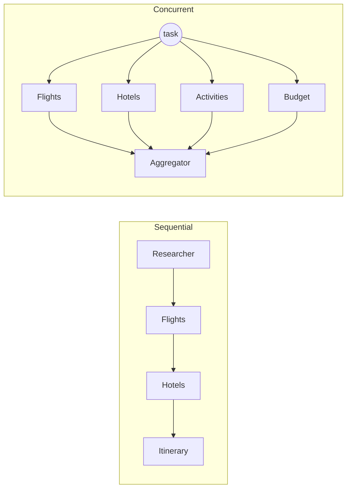
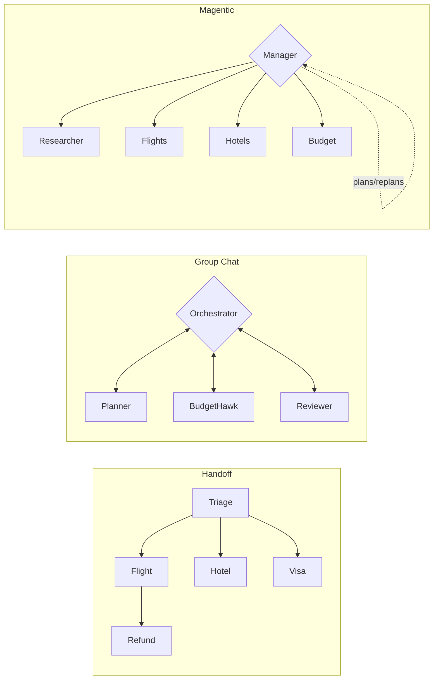

# microsoft_agent_framework

Multi-agent **travel planning** demos built on the
[Microsoft Agent Framework](https://github.com/microsoft/agent-framework), showing
the **five orchestration patterns** — Sequential, Concurrent, Handoff, Group Chat,
and Magentic — each with *multiple* specialized travel agents and full
[Monocle](https://github.com/monocle2ai/monocle) observability.


---

## Table of contents

- [Setup](#setup)
- [Project layout](#project-layout)
- [The five orchestration patterns](#the-five-orchestration-patterns)
  - [1. Sequential](#1-sequential--a-pipeline)
  - [2. Concurrent](#2-concurrent--run-in-parallel)
  - [3. Handoff](#3-handoff--transfer-control)
  - [4. Group Chat](#4-group-chat--collaborate-in-one-room)
  - [5. Magentic](#5-magentic--a-manager-directs-the-team)
- [Observability (Monocle)](#observability-monocle)
- [Pattern cheat-sheet](#pattern-cheat-sheet)
- [References](#references)

---

## Setup

This project uses [`uv`](https://docs.astral.sh/uv/) and requires **Python 3.13+**.

```bash
# 1. Install dependencies.
#    The framework pulls in prerelease packages, so prereleases must be allowed:
uv sync --prerelease=allow

# 2. Activate the virtual environment
source .venv/bin/activate

# 3. Provide an OpenAI key (the examples use OpenAIChatClient)
export OPENAI_API_KEY="sk-..."
# Optional: override the model (defaults to gpt-4o-mini)
export OPENAI_CHAT_MODEL_ID="gpt-4o-mini"
```

> **Tip:** Run every example through `uv run` so it always uses the project's
> `.venv` (e.g. `uv run python agents/orchestrations/handoff_travel.py`). Using a
> bare `pip install` can silently target a different Python (e.g. an Anaconda
> base env) and leave the venv missing packages such as
> `agent-framework-orchestrations`.

> **Why `--prerelease=allow`?** `agent-framework-azure-ai==1.0.0rc6` depends on the
> prerelease `azure-ai-agents>=1.2.0b5,<1.2.0b6`. Without the flag, `uv`'s resolver
> refuses to pick prerelease versions and `uv sync` fails. As an alternative you can
> pin `azure-ai-agents==1.2.0b5` in `pyproject.toml`.

---

## Project layout

```
.
├── agents/
│   ├── travel_agents.py            # single travel agent (baseline)
│   ├── multi_travel_agents.py      # planner + critic (manual orchestration)
│   └── orchestrations/             # the five framework patterns
│       ├── sequential_travel.py
│       ├── concurrent_travel.py
│       ├── handoff_travel.py
│       ├── group_chat_travel.py
│       └── magentic_travel.py
├── main.py
├── pyproject.toml
└── README.md
```

Common building blocks used in every example:

```python
from agent_framework import Agent, tool
from agent_framework.openai import OpenAIChatClient
from agent_framework.orchestrations import (
    SequentialBuilder, ConcurrentBuilder, HandoffBuilder,
    GroupChatBuilder, MagenticBuilder,
)

client = OpenAIChatClient(model="gpt-4o-mini")
agent = Agent(client=client, name="FlightAgent", instructions="...", tools=[search_flights])
```

---

## The five orchestration patterns





---

### 1. Sequential — a pipeline

**Each agent runs in turn, building on the previous agent's output.** Best when
every step depends on the one before it.

**Agents:** `DestinationResearcher → FlightPlanner → HotelPlanner → ItineraryWriter`

```python
from agent_framework.orchestrations import SequentialBuilder

workflow = SequentialBuilder(
    participants=[researcher, flight_planner, hotel_planner, itinerary_writer]
).build()

events = await workflow.run("Plan a 4-day NYC -> SF trip...")
final = events.get_outputs()[0]   # AgentResponse from the LAST agent
```

Run it:

```bash
python agents/orchestrations/sequential_travel.py
```

**Use when:** document-style refinement, multi-stage reasoning, data pipelines.

---

### 2. Concurrent — run in parallel

**Every agent receives the same task simultaneously; results are aggregated.**
Best for gathering diverse, independent perspectives.

**Agents (all at once):** `FlightExpert`, `HotelExpert`, `ActivitiesExpert`,
`BudgetExpert` → fused by a `Summarizer` aggregator.

```python
from agent_framework.orchestrations import ConcurrentBuilder

workflow = (
    ConcurrentBuilder(participants=[flight_expert, hotel_expert, activities_expert, budget_expert])
    .with_aggregator(summarize_results)   # custom fusion of the 4 outputs
    .build()
)
```

Run it:

```bash
python agents/orchestrations/concurrent_travel.py
```

**Use when:** brainstorming, ensemble reasoning, voting, multi-perspective review.

---

### 3. Handoff — transfer control

**Agents transfer full ownership of the conversation to each other** via a handoff
tool call. No central orchestrator — it's a mesh with routing rules.

**Agents:** `triage_agent` routes to `flight_agent`, `hotel_agent`, `visa_agent`;
`flight_agent` can escalate to `refund_agent`.

```python
from agent_framework.orchestrations import HandoffBuilder

workflow = (
    HandoffBuilder(name="travel_help_desk", participants=[triage, flight, hotel, visa, refund])
    .with_start_agent(triage)
    .add_handoff(triage, [flight, hotel, visa])
    .add_handoff(flight, [triage, refund])
    .with_autonomous_mode(turn_limits={triage.name: 4})  # runs without human input
    .build()
)
```

Run it:

```bash
python agents/orchestrations/handoff_travel.py
```

> Handoff is *interactive* by default — when an agent doesn't hand off it asks the
> user for input. This sample uses `.with_autonomous_mode()` so it completes
> end-to-end; remove it for a real help-desk loop.

**Use when:** customer support, expert systems, dynamic delegation by domain.

---

### 4. Group Chat — collaborate in one room

**A central orchestrator coordinates a shared conversation**, choosing who speaks
next (round-robin, a selector function, or an agent orchestrator). Agents iterate
until a termination condition is met.

**Agents:** `Planner`, `BudgetHawk`, `Reviewer` cycle round-robin until the
`Reviewer` replies `APPROVED`.

```python
from agent_framework.orchestrations import GroupChatBuilder, GroupChatState

def round_robin_selector(state: GroupChatState) -> str:
    names = list(state.participants.keys())
    return names[state.current_round % len(names)]

workflow = GroupChatBuilder(
    participants=[planner, budget_hawk, reviewer],
    termination_condition=lambda conv: bool(conv) and "approved" in conv[-1].text.lower(),
    selection_func=round_robin_selector,
).build()
```

Run it:

```bash
python agents/orchestrations/group_chat_travel.py
```

**Use when:** iterative refinement, writer/reviewer loops, quality gates.

---

### 5. Magentic — a manager directs the team

**A powerful manager plans the task, dynamically picks which specialist acts next,
tracks a progress ledger, detects stalls, replans, and synthesizes the answer.**
Best for complex, open-ended tasks where the path isn't known in advance.

**Agents:** `MagenticManager` coordinating `DestinationResearcher`,
`FlightSpecialist`, `HotelSpecialist`, `BudgetAnalyst`.

```python
from agent_framework.orchestrations import MagenticBuilder

workflow = MagenticBuilder(
    participants=[researcher, flight_specialist, hotel_specialist, budget_analyst],
    intermediate_output_from=[researcher, flight_specialist, hotel_specialist, budget_analyst],
    manager_agent=manager,
    max_round_count=12,
    max_stall_count=3,
    max_reset_count=2,
).build()
```

Run it:

```bash
python agents/orchestrations/magentic_travel.py
```

**Use when:** open-ended research + computation, unknown solution path, multi-round
planning. (Group Chat is the simpler cousin without the planning manager.)

---

## Observability (Monocle)

Every example enables [Monocle](https://github.com/monocle2ai/monocle) tracing at
the top of the file, so each agent turn and tool call is captured as a span:

```python
from monocle_apptrace import setup_monocle_telemetry

setup_monocle_telemetry(
    workflow_name="okahu_demos_ms_openai_sequential_travel",
    monocle_exporters_list="file",   # traces written to local files
)
```

Each pattern uses a distinct `workflow_name` so traces are easy to tell apart.
Switch `monocle_exporters_list` to another exporter to ship traces elsewhere.

---

## Pattern cheat-sheet

| Pattern    | Coordination          | Agents run        | Best for                                  |
|------------|-----------------------|-------------------|-------------------------------------------|
| Sequential | Fixed order pipeline  | One after another | Steps that build on each other            |
| Concurrent | None (parallel)       | All at once       | Diverse independent perspectives          |
| Handoff    | Mesh, agent-driven    | One owns at a time| Dynamic delegation / support routing      |
| Group Chat | Central orchestrator  | Selected each round | Iterative refine / review loops         |
| Magentic   | Planning manager      | Manager-directed  | Complex, open-ended, unknown-path tasks   |

---

## References

1. https://github.com/microsoft/agent-framework/tree/main
2. https://commandline.microsoft.com/assert-written-intent-executable-evals/
3. Orchestration docs:
   [Sequential](https://learn.microsoft.com/en-us/agent-framework/workflows/orchestrations/sequential) ·
   [Concurrent](https://learn.microsoft.com/en-us/agent-framework/workflows/orchestrations/concurrent) ·
   [Handoff](https://learn.microsoft.com/en-us/agent-framework/workflows/orchestrations/handoff) ·
   [Group Chat](https://learn.microsoft.com/en-us/agent-framework/workflows/orchestrations/group-chat) ·
   [Magentic](https://learn.microsoft.com/en-us/agent-framework/workflows/orchestrations/magentic)

